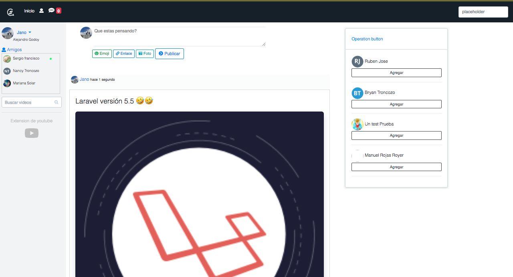
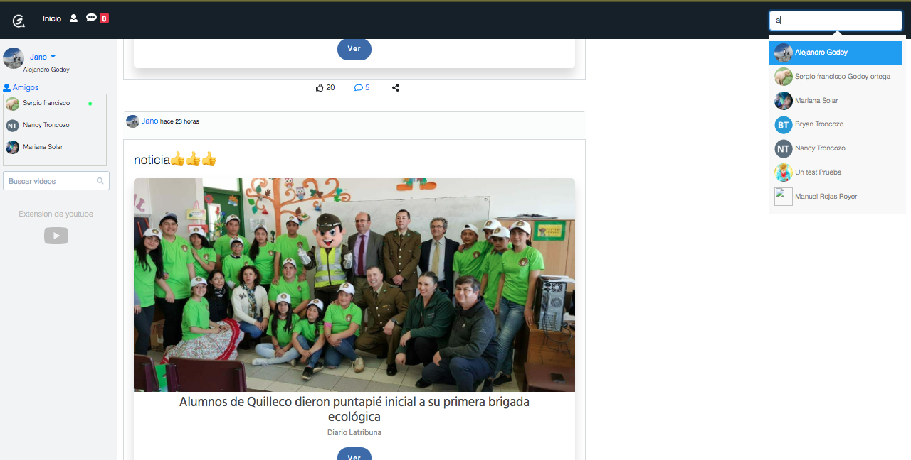
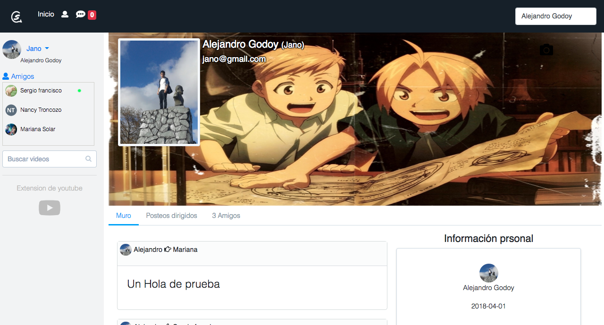
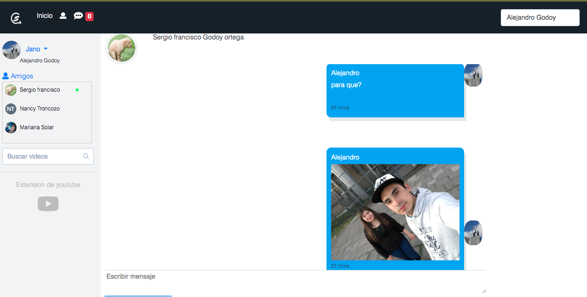
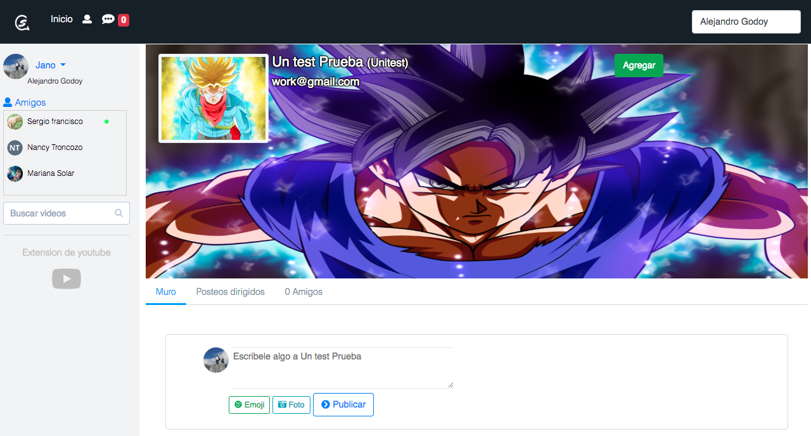

# Red Social

----
## En que consiste?

> Es un proyecto que busca hacer interactuar a los usuarios compartiendo fotos, pensamientos, ideas y enlaces de noticias, permite la comunicación mediante un chat en tiempo real.

## Tecnologías utilizadas

2. Click 'HTML Preview' button.
